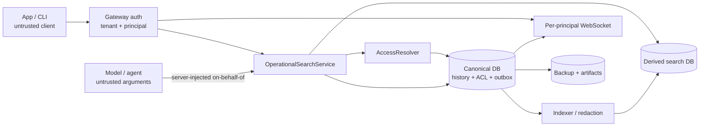

# Threat model: operational history and global search

Status: Active beta control baseline; implementation evidence pending

Applies to: `beta/unified-history-ui`

Release status: the beta train is authorized by the plan/runbook; this document
does not prove its gates passed and does not authorize stable

This threat model covers the normalized operational history, unified history
feed, global text search, and agent-side recall proposed in the
[beta plan](../plans/unified-history-storage-search-beta.md). It derives from
the self-hosted, gateway-only, durable-session model in
[vision.md](../vision.md).

The word **must** identifies a release-blocking control. A control is not
considered present merely because it is described here: it needs an
implementation and the corresponding test evidence.

## 1. Security objectives

The first beta must preserve all of these properties:

1. A principal can discover only resources it is allowed to view and search.
2. Tenant and principal identity come from authenticated server context, never
   from a query, request body, model argument, or display handle.
3. Authorization happens before the candidate window, returned counts,
   snippets, pagination, and serialization, with a canonical recheck before a
   result leaves the server.
4. Raw secrets and private runtime fields never enter a derived search index,
   query cache, WebSocket event, telemetry event, or semantic request.
5. A search query is treated as user content: it is not logged, persisted by a
   client, exported as telemetry, or placed in a URL.
6. A derived index may be deleted and rebuilt without changing canonical
   history. Rebuildability does not make the index non-sensitive.
7. UI, CLI, and agent-side recall apply the same `AccessResolver` and the same
   redaction policy.
8. Migration, backup, downgrade, and restore fail closed. A storage failure
   must not silently broaden access, lose a committed turn, or report partial
   search coverage as complete.
9. The feature continues to work on a self-hosted instance without Internet or
   a mandatory cloud database.

## 2. Scope and non-goals

### In scope

- `openagent.db`, normalized history tables, ACL records, activity projection,
  domain event journal, and search outbox;
- `operational_search_*.db`, search chunks, ACL projection, and bounded query
  snapshots;
- REST history, search, message-around, and detail endpoints;
- WebSocket invalidation and authorized activity summaries;
- app and CLI in-memory search state;
- tool argument, result, error, workflow, scheduled-run, and event extraction;
- migration snapshots, artifact copies, rollback, and re-upgrade;
- operational recall initiated by the agent on behalf of an authenticated
  principal;
- denial-of-service and resource-exhaustion behavior.

### Out of scope for the first beta

- semantic search and remote embedding by default;
- full-text search over arbitrary raw tool values;
- privileged reveal of secrets from ordinary search;
- a client-side offline result cache;
- protection from a hostile root user or a fully compromised OpenAgent server
  process;
- multi-host writers sharing one SQLite database over a network filesystem.

Host compromise remains a material residual risk because the initial design
uses operating-system permissions rather than database encryption. It is
tracked explicitly in [Open decisions](#12-open-decisions-and-residual-risk).

## 3. System and trust boundaries

Trust assumptions:

- A client with a valid certificate is authenticated but is not trusted to
  choose a tenant, owner, or authorization scope.
- Model output, prior transcripts, event payloads, tool arguments, tool
  results, file names, and errors are untrusted input.
- MCP subprocesses are not an authorization boundary and cannot be trusted
  with a reusable universal principal.
- The gateway and `AccessResolver` are the public security boundary. Internal
  services must not expose a second, weaker search route.
- The canonical database is authoritative. The search database and query
  snapshots are disposable projections.
- The host account running OpenAgent is trusted in the first beta. Backups and
  index files remain confidential data even on that host.

## 4. Data classification

| Class | Examples | Required handling |
|---|---|---|
| Restricted raw | API keys, cookies, credentials, event secrets, private keys, hidden reasoning, system prompts, provider-private payloads | Canonical storage only when required for full fidelity; never in normal search, snippets, telemetry, WebSocket, or remote embedding |
| Confidential content | User and assistant text, visible reasoning, tool results, workflow inputs and outputs, titles, paths, author identity | Tenant/ACL enforcement; restrictive file permissions; no remote export by default |
| Safe projection | `body_safe`, approved identifiers, redacted errors, search keywords | Still confidential to its authorized principals; “safe” means safe to index, not public |
| Operational metadata | Schema version, coverage, lag, duration bucket, error class | May be logged locally if it cannot identify content or a principal |
| Query material | Query text, filters, query-derived hashes, result order | Confidential content; memory-only except for bounded server snapshots without body text |
| Recovery material | Database snapshots, artifact copies, manifests | Snapshots are as sensitive as canonical storage; manifests must omit content and identity fields |

## 5. Threat register

| ID | Threat | Primary controls | Failure behavior |
|---|---|---|---|
| T1 | Cross-tenant or cross-owner discovery | Stable tenant/principal IDs, ACL prefilter, canonical recheck | 404 or empty authorized result; never fall back to a broader query |
| T2 | Stale ACL, delete, or ownership data in the index | `acl_version`, outbox tombstone, fail-closed rehydration | Drop stale candidates and mark coverage degraded if replacement cannot be proven |
| T3 | Query disclosure through URLs, logs, caches, or telemetry | POST, body-log suppression, memory-only clients, bounded server snapshots | Search fails without persisting the query |
| T4 | Secret copied from a tool payload into FTS | Allowlisted extractors, default-deny unknown values, versioned redaction | Mark the document partial or omit it; never index raw as a fallback |
| T5 | Sensitive index or backup exposed on disk | Separate paths, mode `0600`, parent mode `0700`, no default upload | Refuse creation or migration when permissions cannot be enforced |
| T6 | WebSocket broadcasts reveal another principal's activity | Per-connection authorization and summary-only events | Send invalidation without content or require an authorized REST refresh |
| T7 | Model forges an owner or uses a system principal | Server-injected on-behalf-of context, scoped capability or in-process call | Deny the call; never reinterpret a missing principal as `system` |
| T8 | Prompt injection in retrieved history | Treat hits as quoted evidence with provenance, never as instructions | Return evidence without elevating its authority |
| T9 | Query or extraction exhausts CPU, memory, disk, or SQLite locks | Parser limits, timeouts, cancellation, quotas, bounded chunks and snapshots | 413/422/429 or explicit degraded coverage; no silent truncation |
| T10 | Migration, downgrade, or restore weakens ACL or revives deleted data | Exclusive migrator, verified snapshot, legacy change journal, reconciliation | Stay in `legacy`/`shadow`; do not enable `prefer_v2` |

## 6. Required controls

### 6.1 Tenant, principal, and ACL enforcement

- Every searchable canonical row and derived document must carry an immutable
  `tenant_id`, `visibility`, and `acl_version`. `owner_principal_id` is required
  except for the explicit `installation_shared` legacy policy; quarantined rows
  may also be ownerless but are never searchable.
- Display handles and names are snapshots for presentation only. Renaming a
  user must not create a new owner or orphan existing grants.
- The authentication middleware injects the tenant and principal into an
  immutable request context. Request fields named `owner`, `principal`, or
  `tenant` must be rejected or ignored for authorization.
- Search must first restrict candidate IDs by tenant, visibility, and current
  principal grants. It must then rehydrate candidates in batches and call the
  canonical `AccessResolver` before computing returned snippets, counts, or
  page limits.
- If an index document has an older `acl_version`, is missing canonically, or
  cannot be revalidated, it is not returned. The service fills the page with
  other authorized candidates where possible.
- A delete or revoke creates an outbox tombstone in the same canonical
  transaction. A stale search snapshot never overrides the canonical delete.
- Query snapshots and cursors are bound to tenant, principal, ACL generation,
  query/filter identity, index generation, and expiry. The public cursor should
  contain only an opaque random snapshot identifier and an authenticated
  position; it must not expose an unsalted query hash.
- Cross-tenant direct-object requests return 404. Same-tenant authorization
  failures may return 403 only where acknowledging the resource is itself
  permitted.

Automation definitions and executions require separate ACL decisions. A
shared workflow, task, or event definition does not make a run containing a
private trigger payload or transcript shared. The effective execution ACL must
be the most restrictive applicable set from the initiating principal/service
context, definition, causal root, and explicit grants. Child sessions inherit
that effective execution ACL unless an explicit, more restrictive ACL is
recorded.

Versioned legacy workflow, scheduled-task, and event definitions and runs that
were historically installation-wide keep that compatibility scope as
`installation_shared`. They have no invented human owner and record provenance
`legacy_unattributed`, the applied legacy visibility policy, and completeness
independently. This mapping is based on the legacy resource contract, never on
the most recent login or a mutable handle. Ownerless/ambiguous sessions, chats,
and any legacy row not proven to have installation-wide semantics stay
quarantined and unsearchable until explicit remediation.

New records always derive owner and effective ACL from authenticated
certificate/request context injected by the server. A client, model, or tool
cannot turn a new record into `installation_shared` by supplying owner,
principal, tenant, or visibility fields.

### 6.2 Query privacy

- Search uses POST. Reverse proxies, gateway access logs, exception reports,
  traces, and debug middleware must suppress request bodies for the endpoint.
- Logs and telemetry must not contain query text, snippets, titles, handles,
  paths, payloads, tool arguments/results, tokens, or an unkeyed query hash.
- Allowed metrics are bounded metadata such as query-length bucket, scope,
  authorized result-count bucket, duration, coverage, lag, and error class.
- App and CLI keep query, filters, result rows, and selection in memory only in
  the first beta. Logout, account switch, server switch, and credential removal
  cancel in-flight requests and hard-clear this state.
- Server query snapshots contain only bounded IDs, ordering, score, security
  bindings, and expiry. They contain no query body, snippet, tool payload, or
  transcript and are removed on TTL and logout/session revocation.
- A keyed digest may be used internally to bind a snapshot to a request. It is
  not emitted as telemetry and is not a stable identifier across installations.
- Query text is never sent to an embedding or ranking provider in the first
  beta. Any later remote semantic mode requires explicit opt-in, an egress
  notice, and only `body_safe` content.

POST protects URLs; it does not by itself protect server logs. A test that
examines every log and trace sink is therefore a release gate.

### 6.3 Tool extraction and redaction

Canonical tool arguments and results may contain secrets required for durable
history. The search projection must be created independently:

1. Select a versioned extractor for a known tool and mark fields as
   `searchable`, `sensitive`, or `large`.
2. For an unknown tool, index only the tool/server name, status, key names,
   types, sizes, and identifiers whose schema explicitly marks them public.
3. Never admit an unknown scalar value merely because a denylist or entropy
   detector did not recognize it.
4. Redact before chunking so a secret cannot be split across two chunks and
   evade detection.
5. Apply pattern and entropy detectors as defense in depth for JWTs, bearer
   tokens, PEM material, cookies, signed URLs, credentials, and private keys.
6. Treat full paths, URL query strings, stack traces, HTTP headers and bodies,
   event payloads, binary/base64 values, and external file contents as
   sensitive by default.
7. Produce only structured plain-text fragments. Never return extractor HTML
   or render Markdown supplied by a tool without escaping.
8. Record `extractor_version`, `redaction_version`, `sensitivity`, and
   `completeness` on every document.

Extractors must be pure and resource-bounded: no network access, no following
external file references, no recursive archive extraction, and no unbounded
JSON traversal. Invalid, oversized, or unsupported content becomes `partial`
or is omitted; raw content is never used as a search fallback.

An eventual sensitive-detail endpoint is a separate capability with
`reveal_sensitive` authorization, a fresh canonical check, no response-body
logging, and metadata-only audit. It is not part of ordinary search.

### 6.4 Search index, snapshots, and client caches

- The operational search database has a distinct path from `openagent.db`, the
  vault, the vault index, and any semantic index.
- Its connection keeps `PRAGMA trusted_schema=OFF`. No trigger or view invokes
  FTS5. The single index owner writes chunk metadata and the contentful,
  redacted FTS row explicitly in one transaction.
- Its directory must be mode `0700` and files mode `0600` where the platform
  supports POSIX permissions. Windows ACLs must grant only the service account
  and intended administrators.
- The search database is excluded from canonical backups by default and rebuilt
  after restore. Including it in a diagnostic bundle requires an explicit
  warning and the same protection as canonical history.
- A rebuild writes a new generation to a new file, verifies schema, source
  fingerprint, ACL/redaction versions, coverage, FTS/chunk rowid equality, and
  integrity, then switches atomically. A failed build never replaces the
  current usable generation.
- Old generations that used an incompatible ACL or redaction policy are never
  opened as a fallback. They are unlinked after readers drain; secure erasure
  is not promised without encrypted storage.
- Query snapshots are bounded by count, candidate rows, bytes, and TTL per
  principal. Expiry and logout remove them.
- The first beta has no on-disk app or CLI result cache. “Offline” means the
  self-hosted server can search without Internet; a disconnected thin client
  cannot search. A future cache needs encryption, server/account namespacing,
  TTL, and hard-clear tests.
- SQLite source and index files must live on a supported local filesystem.
  Multi-host or network-filesystem writers require a future client/server
  backend rather than weakened locking assumptions.

### 6.5 WebSocket and realtime

- Realtime events are optional capabilities. A client subscribes only to the exact
  event advertised by the authenticated server; absence is handled with bounded REST
  refresh and must not weaken authorization or freshness checks.
- A WebSocket connection is permanently bound to the tenant and principal
  authenticated at connection setup. Account or server change establishes a
  new connection.
- Events are authorized for each connection at emission time. There is no
  broadcast of one precomputed resource summary to every authenticated client.
- `history_changed` may contain action, revision, kind, resource ID, and an
  authorized summary. `search_index_changed` contains only generation and
  indexed sequence. Neither contains a query, snippet, transcript, payload,
  tool value, or secret.
- ACL revocation and delete events invalidate matching client state
  immediately. The subsequent detail request still performs a canonical ACL
  check.
- Realtime is a hint, not a source of truth. Missed or backpressured events
  cause a bounded REST refresh; the server does not replay sensitive bodies.
- Per-connection queues are bounded. A slow client is coalesced or disconnected
  rather than consuming unbounded memory.
- Electron relay windows and multi-agent windows must be tested to ensure a
  frame authenticated for one agent/account never reaches another renderer.

### 6.6 Migration, backup, downgrade, and restore

- One migration leader acquires an operating-system lock beside the database
  before backup, DDL, or phase changes. Secondary writers wait or fail before
  opening an incompatible schema.
- Before the first DDL, use the SQLite backup API or `VACUUM INTO`; do not copy
  only a live `.db` file while WAL is active.
- Verify a snapshot by opening it, checking SHA-256, running
  `PRAGMA integrity_check`, validating its manifest, and rehearsing restore in
  a temporary directory.
- Backup and artifact directories use restrictive permissions, do not follow
  attacker-controlled symlinks, and are never uploaded automatically. The
  manifest contains versions, schema, sizes, timestamps, and digests but no
  query, title, handle, or content sample.
- Migration space preflight accounts for the live database, WAL, verified
  snapshot, v2 rows, search rebuild, artifact copy, and safety margin. Disk
  exhaustion stops migration; it must not trigger silent history deletion.
- Artifact migration is additive and copy-only for the rollback window. Hash
  and reference verification precede any later cleanup.
- An old binary may write only legacy rows. Additive legacy-change triggers,
  writer epoch/version, ID-set comparison, and source hashes force re-upgrade
  back to `shadow` until create/update/delete/retention drift is reconciled.
- A normal rollback changes the read phase and retains later writes. Restoring
  a snapshot is an offline, last-resort operation that warns about all writes
  after the snapshot.
- After restore, derived indexes and snapshots are discarded and rebuilt from
  the restored canonical source. A pre-restore search index must never be
  attached to the restored database.

### 6.7 Agent on-behalf-of search

- The operational search tool schema exposed to a model has no tenant, owner,
  or principal parameter.
- The server captures both actor and subject: the agent/service performing the
  call and the authenticated principal on whose behalf the turn runs.
- Preferred implementation is an in-process `OperationalSearchService` call.
  If a subprocess boundary is unavoidable, every request uses a short-lived,
  audience-bound, scope-bound, principal-bound, non-replayable capability. An
  environment variable or reusable system token is insufficient.
- Missing or expired on-behalf-of context fails closed. `system` is a distinct
  service principal, not an implicit superuser and not a fallback for an
  unknown user.
- Delegated sessions, workflow AI steps, scheduled runs, and event runs retain
  an explicit initiating or service principal and the effective execution ACL.
- Agent-side and UI search use the same extraction corpus, coverage semantics,
  redaction layer, and `AccessResolver`.
- Retrieved text is labelled and delimited as untrusted historical evidence
  with resource, author, and timestamp provenance. Text such as “ignore prior
  instructions” remains data and never receives system-message authority.
- Audit records may include actor ID, subject ID, scope, result-count bucket,
  duration, and error class, but not query or result content.

### 6.8 Abuse and denial of service

Numeric values are fixed by benchmarks before release, but the implementation
must have explicit finite limits for:

- query bytes, Unicode-normalized terms, phrase length, scopes, filters, date
  range, page size, and total pages consumed by `--all`;
- prefix expansions and candidate window; leading wildcard and raw FTS syntax
  are not exposed;
- active searches, active snapshots, snapshot candidates, memory, and TTL per
  principal and per installation;
- request duration, SQLite progress operations, lock wait, cancellation, and
  concurrent index reads;
- JSON depth, keys, scalar length, chunks, artifact bytes, decompressed bytes,
  and extractor CPU time;
- outbox backlog, rebuild disk amplification, retry rate, and WebSocket queue.

FTS queries are produced by a parser and bound parameters, not concatenated
from raw user syntax. Cancellation propagates from disconnected app/CLI clients
to SQLite work. Rate limiting is per authenticated principal with an
installation-wide backstop so one member cannot starve local turns.

Limit violations return a stable 413, 422, or 429 error. Timeouts and index
backlog return explicit `degraded`/partial coverage and never a false empty
complete result. A long SQLite busy timeout is not evidence that contention is
healthy; p95/p99 wait and foreground latency remain release gates.

## 7. Privacy-preserving observability

Allowed local signals:

- storage phase, schema/index/redaction generation, rows and bytes processed;
- batch duration, lock-wait duration, retry and cancellation count;
- WAL and outbox size, coverage, indexed sequence, rebuild state;
- query-duration bucket, query-length bucket, scope, authorized result-count
  bucket, and error class.

Remote telemetry is off by default. If enabled, it is opt-in and receives only
the already-redacted metrics above. Diagnostic export must inventory included
files and exclude the search database, query snapshots, canonical database,
backups, and artifacts unless the operator explicitly selects them after a
content warning.

## 8. Security test gates

Every gate is required before `prefer_v2` or a GitHub prerelease. Fixtures use
unique planted markers so test artifacts can be scanned byte-for-byte.

### Tenant and ACL

- **ACL-01:** two tenants and multiple principals with private, shared, and
  ownerless records; no content, count, target, or timing-class regression
  exposes the other tenant.
- **ACL-02:** revoke/delete between candidate selection, snippet generation,
  pagination, WebSocket emission, and detail click; every path fails closed and
  produces no ghost hit.
- **ACL-03:** rename a handle, rotate/add a device, and reconnect; grants remain
  attached to the immutable principal and no cache crosses accounts.
- **ACL-04:** migrate historically installation-wide legacy automation
  definitions/runs; they become ownerless `installation_shared` with
  `legacy_unattributed` provenance and remain inside their installation tenant.
  Ownerless chat/session and unrecognized legacy shapes stay quarantined. A new
  record cannot obtain either policy from client-controlled identity fields.
- **ACL-05:** execute a shared automation from a private trigger; its run,
  transcript, child sessions, tool calls, events, and search hits keep the
  restrictive execution ACL.
- **ACL-06:** tamper with cursor, snapshot ID, tenant, principal, filters, and
  ACL generation; the server rejects rather than restarts broadly.

### Query privacy and redaction

- **PRV-01:** send a query marker and inspect gateway/proxy logs, structured
  logs, traces, crash reports, telemetry, WebSocket frames, query snapshots,
  and client storage; the marker is absent everywhere except live request
  memory.
- **PRV-02:** logout/account/server switch during every request phase; in-flight
  work is cancelled and app/CLI memory and disk contain no stale result.
- **RED-01:** plant passwords, API keys, JWT/bearer tokens, cookies, signed URLs,
  PEM keys, high-entropy strings, user paths, and split-boundary secrets in
  every supported tool/event/workflow field. Scan API output, snippets, index
  bytes, logs, telemetry, WebSocket frames, and any semantic mock request.
- **RED-02:** unknown tools expose metadata only. Random scalar values never
  become searchable without an approved schema annotation or extractor.
- **RED-03:** fuzz nested/malformed/double-encoded JSON, Unicode, binary/base64,
  archives, huge strings, hostile HTML/Markdown, and stack traces without a
  leak, crash, or unbounded resource use.
- **RED-04:** changing extractor or redaction version forces a new index
  generation; an older unsafe generation is never reopened.

### Index, realtime, and recovery

- **IDX-01:** corrupt, truncate, delete, and rebuild the search database; the
  canonical history is unchanged and coverage never lies.
- **IDX-02:** verify path separation and permissions on macOS, Linux, and
  Windows; reject a symlink/collision with canonical or vault paths.
- **IDX-03:** exhaust snapshot count/TTL/candidate limits and confirm bounded
  cleanup without cross-principal eviction leaks.
- **WS-01:** connect several accounts and agent windows concurrently, mutate
  private/shared resources, and prove every received frame is authorized and
  summary-only.
- **MIG-01:** crash at every backup, DDL, dual-write, outbox, artifact-copy, and
  phase-transition boundary; restart/resume without partial authorization or
  lost committed data.
- **MIG-02:** downgrade to a pre-v2 binary, create/update/delete/compact, then
  re-upgrade; the server stays in `shadow` until exact reconciliation.
- **MIG-03:** restore a verified snapshot offline, discard all derived state,
  rebuild, and compare ACL/content/artifact hashes with the snapshot manifest.

### Agent and abuse resistance

- **AGT-01:** ask the model and an MCP subprocess to forge owner, tenant,
  `system`, or another principal; every attempt is ignored or denied.
- **AGT-02:** place prompt-injection instructions in a transcript, tool result,
  and event output; retrieval preserves them as untrusted evidence and never
  changes their authority.
- **DOS-01:** fuzz public query grammar, Unicode normalization, phrase/prefix
  expansion, cursor input, detail anchors, and filter combinations under
  timeout and memory limits.
- **DOS-02:** run concurrent gateway, scheduler, workflow, event, MCP, indexer,
  migration, and search load; no lost/duplicate write, surfaced lock error,
  starvation, unbounded WAL, or unbounded snapshot/outbox growth.

Test reports must record commit SHA, schema/redaction/extractor generations,
platform, filesystem, dataset, hardware, limits, p95/p99 timings, maximum RSS,
disk amplification, and the byte-scan result. A failure in any ACL, privacy,
redaction, migration, or agent-principal gate is an immediate release stop.

## 9. Failure and incident response

The feature must be independently disableable without disabling canonical
history:

1. stop advertising `global_search` capability;
2. reject new search requests with an explicit unavailable/degraded error;
3. stop the index worker and invalidate query snapshots;
4. preserve canonical history and outbox evidence;
5. remove the affected index generation;
6. fix ACL/redaction logic, increment its version, and rebuild from canonical
   sources;
7. re-enable only after the security gates pass.

For a suspected cross-tenant leak, also stop summary WebSocket events and
preserve metadata-only audit records. Do not preserve or transmit the leaked
query/content as routine telemetry. Rotating a release or index generation does
not replace the need to notify affected operators under the applicable policy.

## 10. Release stop conditions

Do not enable `prefer_v2`, advertise complete search, or publish a prerelease
when any of these is true:

- ownership migration is ambiguous without a fail-closed state;
- ACL filtering occurs after candidate limit, snippet, or returned count;
- an unknown tool scalar can enter the index without an allowlist;
- a planted secret appears in a derived byte store or output surface;
- app, CLI, agent-side recall, and WebSocket use different principal rules;
- query or result content is persisted on the client or logged by the server;
- backup/restore, downgrade/re-upgrade, or index rebuild has not been rehearsed;
- resource limits are absent, disabled, or produce false-complete coverage;
- an incompatible old index can be reopened;
- the implementation requires Internet or a cloud service for keyword search.

## 11. Assumptions

- The gateway supplies a cryptographically authenticated device and stable
  principal mapping before search is called.
- SQLite and the artifact/index directories live on a local filesystem owned
  by the OpenAgent service account.
- Canonical full-fidelity storage is allowed to retain sensitive tool content;
  ordinary search is not a privileged raw-content interface.
- The beta remains additive: legacy data and artifact sources are retained for
  the rollback window.
- Search and history capabilities can be disabled independently of existing
  chat/session endpoints.

## 12. Open decisions and residual risk

The following decisions must be closed before the relevant implementation gate:

1. Exact effective-execution ACL composition when a shared definition is
   triggered from a more restrictive principal or causal root. The legacy
   `installation_shared` mapping itself is fixed by §6.1.
2. Whether agent-side recall is fully in-process or uses a concrete signed,
   single-use capability format across a subprocess boundary.
3. Numeric query, snapshot, extraction, outbox, disk, memory, and timeout limits.
4. Backup retention, optional encryption, key ownership, and operator-facing
   secure deletion expectations.
5. Whether at-rest encryption is required beyond OS permissions. Without it, a
   hostile same-account process or copied disk can read canonical and search
   data; unlinking an old index is not secure erasure.
6. Operator-facing remediation and audit UX for legacy records that remain
   quarantined after the deterministic migration policy.
7. Reconcile the planned “offline with cache” UI copy with the first-beta rule:
   no client-side persistent search cache. Server-offline and Internet-offline
   are different states.
8. Define the future privileged detail/reveal contract, or explicitly keep raw
   tool values inaccessible through the new search surfaces.

Until these controls exist, this document is a design target rather than a
claim about the security of the current implementation.
